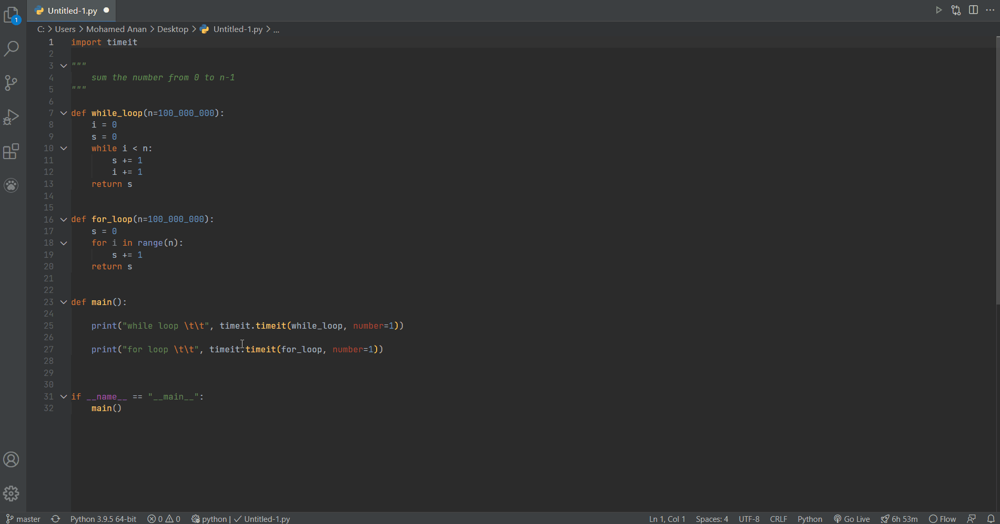

# VS Code - DevDocs Tab
<h1 align="center"> 

</h1>

[](https://vsmarketplacebadge.apphb.com/version/Anan.devdocstab.svg)
[](https://vsmarketplacebadge.apphb.com/installs-short/Anan.devdocstab.svg)
[](https://vsmarketplacebadge.apphb.com/downloads-short/Anan.devdocstab.svg)
[](https://vsmarketplacebadge.apphb.com/rating-star/Anan.devdocstab.svg)

## Description

An extension for Visual Studio Code to 🔍search for documentation on DevDocs.io faster⚡️ by displaying it in a tab inside VS Code.

## Installation

Launch VS Code Quick Open (Ctrl+P), paste the following command, and press enter.

```ext install anan.devdocstab```

or:

[Download from VisualStudio Marketplace](https://marketplace.visualstudio.com/items?itemName=Anan.devdocstab)

## Screenshot



## Features

The extension search your selected text from the current active file in DevDocs.io by using shortcut or by using mouse>Right-Click>"DevDocsTab: Search in DevDocs.io". Also a convenient `DevDocsTab` command could be used via command palette.

## Commands

Name                   | Description                              | Keybindings
--------------------   | ---------------------------------------  | ------------
DevDocsTab.home        | Open DevDocs Home Page                   | `ctrl+k ctrl+k`
DevDocsTab.search      | Search DevDocs with the selected words   |
DevDocsTab.preferences | Open DevDocs Docs/Settings Page          |
DevDocsTab.offline     | Open DevDocs Offline Documentation page  | 

## General Notes

This is a simple wrapper around DevDocs.io. All documentations are provided and hosted by DevDocs.io. The extension has no control over DevDocs.
For best user experience, you should configure it manually:

* Run `DevDocsTab.preferences` You can choose enabled DOCS, choose theme, and general preferences.
* Run `DevDocsTab.offline` to cache documentations locally.

## Contribution

Feel free to make a pull request or open a new issue.

## Changelog

[CHANGELOG](CHANGELOG.md)

## License

This project is licensed under the MIT License - see the
[MIT](LICENSE.txt) file for details.

---

**Enjoy!**
